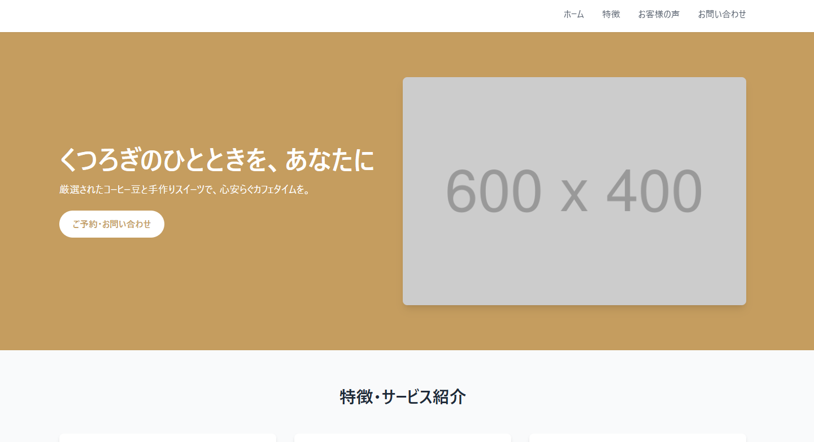
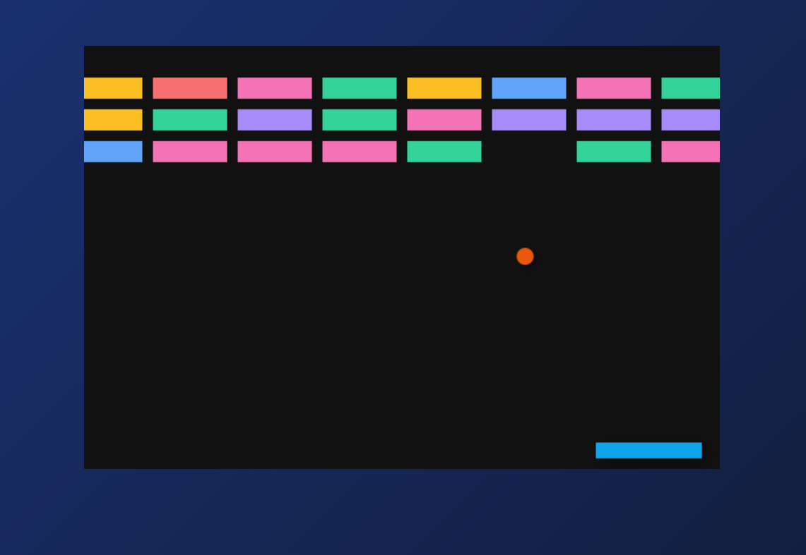
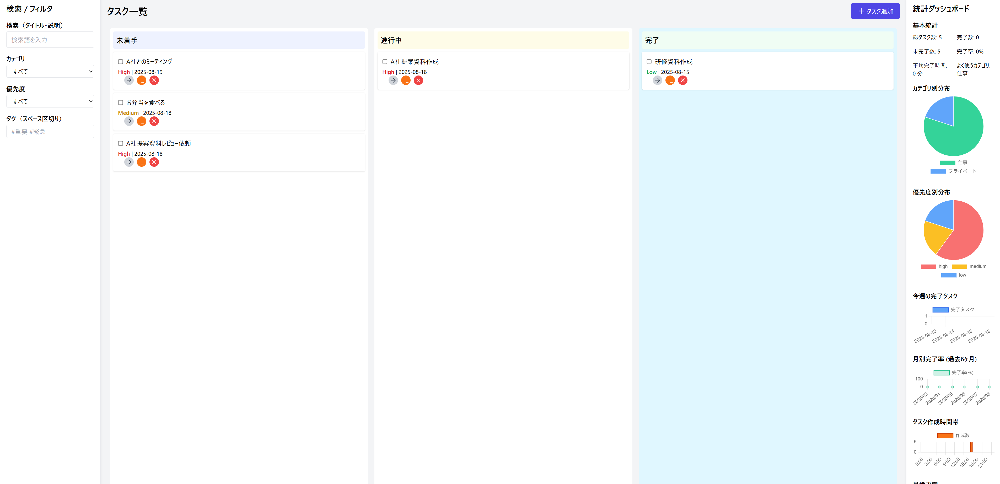

# 0. このハンズオンについて

本ハンズオンでは **LLMを使いWebアプリケーション開発をすることで、AI主体のコーディング手法を理解すること** を目標に、以下の構成で進めていきます。

- AI主体のコーディング手法「Vibe Coding」とは何かを理解する
  - ⛳️初学者の人のゴール
- AIとの対話でシンプルなWebページを作る
  - ⛳️通常のゴール  
- プロンプトを改善してより高品質なコードを生成する
  - ⛳️進みが早い人のゴール

人によっては既に知っている内容も含まれると思いますので、適宜先へ進んでください。

なお、本ハンズオンは **「LLMにどのように指示を与えれば上手くコーディングができるか」** にフォーカスを当てており、開発したWebアプリケーションを完璧に動作させるところはさほど重要ではないので、結果、上手く動かなくてもあまり気にしないでください。

（AIは不確実性が多く、同じ指示でも上手くいくときといかない場合があります）

頑張っていきましょう！


# 1. Vibe Codingの概要

## 1.1 Vibe Codingとは？

**Vibe Coding（バイブコーディング）** は、AI（特に大規模言語モデル）を軸にした新しいソフトウェア開発手法です。
具体的には以下のような特徴があります：

- **自然言語で指示する**: プログラミング言語を使わなくても、普段の言葉でAIにコードを書いたり修正したりしてもらえる。
- **「やりたいこと」を伝えるだけで開発可能**: 「どうやって実装するか」ではなく、「何を実現したいか」をAIに伝えると、AIが主体的にコードを書いてくれる。
  - 例：
    - 要望：「サイトにお問い合わせフォームを追加して、送信された内容をメールで受け取れるようにしたい」
    - AIの対応：必要なHTMLフォーム、送信処理のバックエンドコード、メール送信の設定まで一式を提案・生成
    - 結果：ユーザーはコードの詳細を知らなくても、目的通りの機能を短時間で実装できる

- **少しずつ改善しながら開発を進める**: AIが作ったものを確認して、フィードバックを繰り返しながら徐々に完成度を高める。

## 1.2 Vibe Codingがもたらす恩恵

####  開発スピードが大きく向上する
- プロトタイプやPoC（概念実証）の開発時間が短縮される
- アイデアから実際に動くソフトウェアを作るまでの期間が短くなる

#### ソフトウェア開発の民主化  
- プログラミング経験があまりなくても、ソフトウェアを作れるようになる
  - 入門書レベルの最低限の知識は必要です
- 技術的なハードルが下がり、クリエイターとして活躍できる人が増える
  - 「こういうものが欲しい」というビジョンは明確だが、従来は技術的な実装方法が分からないために諦めていた人もVibe Codingにより、アイデアを直接形にできるようになった

#### 開発者の生産性向上
- 繰り返しの単純作業をAIに任せられるため、より創造的な課題に集中できる
- 設計や課題解決といった、コーディング以外の重要な作業により多くの時間を割ける

## 1.3 Vibe Codingの課題とリスク
#### コード品質に関する懸念
- AIが間違った情報を覚えていたり、勘違いしていることがあり、動かないコードや問題のあるコードを作ってしまうことがある
  - 特定のフレームワークやライブラリを用いる開発だと、何かしらの工夫をしないと実用性のあるソフトウェアを開発するのは難しい
- AIが作るコードは、その場では動くけれど、後から見ると整理されておらず、修正や機能追加が難しくなってしまう場合がある
  - いわゆるスパゲッティコードになりがち

#### デバッグ作業の複雑化
- AIが作ったコードの中身がよく分からないと、何かおかしくなった時に原因を見つけるのが難しく、直すのにも時間がかかる
  - 使用するプログラミング言語の入門書レベルの基礎知識は欲しい理由の一つ
- AIが作ったコードがどういう仕組みで動いているのかを理解するために、結局は勉強し直す必要が出てくる

#### セキュリティとプライバシーの懸念
- AIが意図せずにセキュリティホールを含んだコードを生成する可能性がある
  - Webアプリケーションであれば、クロスサイト・スクリプティング（XSS）の脆弱性があるスクリプトを生成することが多々ある
- AIに指示を出すときに、うっかり会社の重要な情報や個人情報を含めてしまい、それが外部に漏れてしまう危険性がある

#### スキルと依存性の問題
- 基礎的なプログラミング能力や深い理解力の発達を阻害する可能性がある
- エッジケース対応、最適化が難しい
  - 特殊な状況や複雑な問題が起きた時の対応や、アプリの動作を早くするといった細かい調整が難しくなる

#### 大きなシステムでは難しい
- 2025年8月現在、簡単なアプリや試作品を作るのには向いているが、本格的な開発はまだ苦手
- 企業で使うような大きくて複雑なシステムになると、AIだけでは対応しきれない部分が多い

## 1.4 Vibe Codingのベストプラクティス

#### 段階的アプローチ
- まずは一番大事な機能から始める
- 少しずつ細かい部分や新しい機能を追加していく
- 一度にたくさんのことを頼むとAIが混乱するので、焦らずに進める

#### 明確で詳細な指示
- どう動かしたいか、画面をどうしたいかを具体的に伝える
- あいまいに言うより、はっきり詳しく伝えた方がいいものができる
- 「こんな風になってほしい」という例を見せる
- 使いたいツールやライブラリがあれば、そのドキュメントも一緒に渡す

#### 柔軟性と反復改善
- どんどん試してみる
- AIが作ったものを実際に動かしてみて、結果を見ながら指示を変えていく
- 最初から完璧を目指さず、少しずつ良くしていくことを大切にする


## 1.5 エラー発生時の一般的なアプローチ
 - Vibe Codingでは、エラーが発生したらまずAIツールにエラーメッセージをそのまま入力し、修正を依頼するのが一般的
 - 初回の修正で解決しない場合は、AIにさらに修正を求める
 - 今回はフロントエンド開発なので、開発者ツールからエラーメッセージを取得する

#### 【エラー修正用テンプレート】
```
以下のエラーが発生しました。コードを修正してください。

**エラーメッセージ:**
[エラーメッセージをここに貼り付け]


修正されたコードと、エラーの原因について簡潔に説明してください。

```

---

# 2. ハンズオン実行環境の準備

## 2.1 本来のVibe Codingとの違いについて

実際のVibe Codingでは、CursorやGitHub Copilot、Claude CodeのようなAIコーディングツールを使います。これらのツールはエディタやターミナル上で直接コードを書いてくれるので、まるでAIがペアプログラミングをしてくれているような感覚でコーディングできます。

ただ、今回のハンズオンではチャットボット形式のAIを使います。理由はシンプルで：


- **面倒な環境構築がいらない**: 専用ツールをインストールしたり設定したりする手間がない
- **AIの思考過程がよく見える**: どんな風にコードを考えて作っているかが分かりやすい

- **どのAIでも試せる**: ChatGPTでもClaudeでもGeminiでも、同じようなやり方で練習できる

そのため、AIが作ったコードを自分でコピペしてエディタに貼り付ける作業が発生します。本格的なVibe Codingと比べると少し手間ですが、「AIと対話しながらプログラミングする」というハンズオンの核心部分は十分に味わえるはずです。

## 2.2 必要なツール

1. **AIチャットツール**

     - チャットボット形式でAIと対話ができるツール
     - モデルの指定はしませんが、GPT-4o以上の性能があるモデルが望ましいです
     - 例：
        - ChatGPT (https://chat.openai.com)
        - Google Gemini (https://gemini.google.com)

2. **テキストエディタ**
   - VS Code、Sublime Text、Atomなど任意のエディタ

3. **ウェブブラウザ**
   - Chrome、Firefox、Safari、Edgeなど


## 2.3 ハンズオンの進め方

このハンズオンは、**用意されたコーディング用プロンプトをチャットボットにコピペして進める**のが基本フローです。

### 流れ

1. **プロンプトをコピペして送信**

   * 章内の【プロンプト例】をそのまま貼り付けます。

2. **生成コードをエディタに貼り、保存・表示**

   * `index.html` など指定のファイルに貼り付け、ブラウザで確認。

3. **動作確認**

   * 表示・挙動をチェックします。

4. **修正依頼**

   * エラーや不具合があれば、**エラーメッセージをそのまま貼り付けて**「修正して」と依頼します（→「1.5 エラー発生時…」参照）。

### 会話履歴の扱い

本資料の各【プロンプト例】は、各お題（初級編/中級編/上級編）ごとに、同じチャットスレッドで連続して会話することを前提に設計しています。

お題の途中で履歴を消したり別スレッドへ移動すると、これまでの前提（使用技術・制約条件など）が失われ、出力品質が下がります。

* **お題の途中**：履歴を消さない・スレッドを分けない
* **お題を切り替える時**：新しいスレッドを作成（前お題の文脈が混ざらないようにする）

---
# 3. LLMでWebアプリケーションを作ろう：初級編

## 3.1 今回作るもの

あなたの好きなものをテーマにしたランディングページを作成します。

例えば：
- カフェ
- サーバルーム
- 猫
- 水族館

自分が興味のあるテーマを一つ選んでください。



## 3.2 準備

まず、作業用のフォルダを作成しましょう。

1. 任意の場所に `vibe-coding-handson` フォルダを作成
2. その中に `index.html` ファイルを作成


## 3.3 基本構造の作成

### ステップ1: AIに基本的なHTMLを依頼

選んだテーマを使って、以下のようなプロンプトをAIに送信してください

※「カフェ」の部分を自分の選んだテーマに変更してください


【プロンプト例】
```
カフェのランディングページをTailwind CSSで作成してください。

要件：
- Tailwind CSS は <script src="https://cdn.tailwindcss.com"></script> でCDN経由で読み込む
- モダンでレスポンシブなデザインにする
- 以下のセクションを含める：
  - ヘッダー（ナビゲーション付き）
  - ヒーローセクション
  - 特徴・サービス紹介
  - お客様の声
  - お問い合わせフォーム
  - フッター
- 画像はhttps://placehold.jp/ のダミー画像を使用する
- 1つのHTMLファイルで完結させる
- 出力は1つのコードブロックにすること

```

### ステップ2: 生成されたコードを確認

AIが生成したHTMLコードを `index.html` にコピペして、ブラウザで開いて確認してみましょう。

### よくある問題と対処法

**問題**: コードが途中で切れている
**対処法**: 「続きを教えてください」とAIに伝える

**問題**: レイアウトが崩れている
**対処法**: 「レイアウトが崩れているので修正してください」と具体的に伝える

## 3.4 デザインの改善

### ステップ3: デザインの調整

基本的なページができたら、さらに改善していきましょう。
以下のようなプロンプトを試してみてください：

【改善プロンプト例】


```
現在のランディングページをより魅力的にするために以下の改善をしてください：

1. ヒーローセクションにグラデーション背景を追加
2. カードコンポーネントにホバーエフェクトを追加
3. より現代的なフォントとカラーパレットを使用
4. アニメーション効果を追加（CSSアニメーションで）
5. アイコンを追加（Heroicons CDNを使用）

修正後の完全なHTMLコードを教えてください。
出力は1つのコードブロックにすること
```

## 3.5 お問い合わせフォームの機能追加
### ステップ4: フォームの機能強化

【フォーム改善プロンプト】
```

お問い合わせフォームを以下のように改善してください：

1. バリデーション機能を追加（JavaScript）
2. 送信時の確認メッセージ表示
3. フォームの入力項目を充実（名前、メール、電話、メッセージ、サービス選択など）
4. エラーメッセージの表示機能
5. 送信ボタンのローディング状態

実際のメール送信機能は不要で、JavaScriptでの模擬送信で構いません。
修正後の完全なHTMLコードを教えてください。
出力は1つのコードブロックにすること
```

## 3.6 完成とテスト

### 最終確認項目

✅ **デスクトップ表示**: レイアウトが正しく表示される  

✅ **ナビゲーション**: メニューが正しく動作する  

✅ **フォーム**: バリデーションが動作する  

## 3.7 発展課題（時間がある人向け）

時間に余裕のある方は、以下の機能追加にもチャレンジしてみてください：


### ダークモード対応
```
ダークモード切り替え機能を追加してください。
ローカルストレージに設定を保存する機能も含めてください
```

### 多言語対応
```
日本語と英語の切り替え機能を追加してください
```

---

# 4. LLMでWebアプリケーションを作ろう：中級編

## 4.1 今回作るもの

HTML、JavaScript、Tailwind CSSだけを使って動作するシンプルなゲームを作成します。

例：

* ブロック崩し
* オセロ
* 神経衰弱

今回は例として「ブロック崩しゲーム」を作ります。




## 4.2 準備

初級編で作った`vibe-coding-handson`フォルダ内に新しいHTMLファイルを作成します。

* ファイル名: `breakout.html`

## 4.3 基本的なゲーム構造の作成

### ステップ1: 基本的な画面構成

以下のプロンプトをAIに送信してください。

【プロンプト例】

```
HTML、JavaScript、Tailwind CSSを使って、ブロック崩しゲームを作ってください。

**要件：**

- Tailwind CSSは `<script src="https://cdn.tailwindcss.com"></script>` を使いCDNで読み込む
- 画面にはゲームエリア（canvas）とスコア表示を含める
- JavaScriptでパドル（バー）をマウス操作で左右に動かせるようにする
- ボールが壁に当たったら跳ね返る
- **【パドルとボールの衝突処理】**
  - パドルの中央部分にボールが当たった場合：垂直方向に跳ね返る
  - パドルの左端に近づくほど：ボールは左斜め上に跳ね返る角度が急になる
  - パドルの右端に近づくほど：ボールは右斜め上に跳ね返る角度が急になる
  - ボールがパドルに当たった瞬間に視覚的フィードバック（パドルの色変化など）を表示

- 画面上部には複数のブロックが並び、ボールが当たると消えるようにする
- スコアはブロックを消すごとに加算される
- ボールが画面下に落ちたらゲームオーバー表示をする
- 1つのHTMLファイルで完結させる
- 出力は1つのコードブロックにすること

```

### ステップ2: AIからのコードを確認

AIが生成したHTMLコードを`breakout.html`にコピペし、ブラウザで動作確認しましょう。

動作確認のポイント：

* パドルがマウスに追随する
* ボールが跳ね返る
* ブロックが消える
* スコアが正しく増える

うまく動かない場合は、エラー内容をAIに具体的に伝えて修正してもらいましょう。

## 4.4 ゲームプレイの改善

### ステップ3: ゲームの難易度と挙動の調整

以下の改善をAIに依頼します。

【プロンプト例】

```
現在のブロック崩しゲームに以下の改善をしてください：

1. ゲーム開始前にスタートボタンを表示し、クリックでゲーム開始する
2. ブロックを複数の色でランダムに表示する
3. ボールの速度を徐々に上げて難易度を高める
4. ブロックをすべて消したら「ゲームクリア！」と表示する

修正後の完全なHTMLコードを教えてください。
出力は1つのコードブロックにすること
```

### ステップ4: 改善したコードを再確認

* スタートボタンや難易度調整が正常に動作するか
* ブロックの色がランダムか
* ボールの速度が徐々に上がるか

## 4.5 見た目の改善

### ステップ5: 視覚効果の追加

ゲームにアニメーションやデザインの工夫を加えてさらに改善しましょう。

【プロンプト例】

```
ゲームの見た目を魅力的にするため以下を改善してください：

1. パドルやボールに影をつけて立体的に見せる
2. ブロックが消えるときにフェードアウトのアニメーションをつける
3. スコア表示をモダンなスタイルに変更
4. 背景色をグラデーションにする
5. ゲームオーバー時に再スタートできるようにボタンを追加

修正後の完全なHTMLコードを教えてください。
出力は1つのコードブロックにすること
```

### ステップ6: 最終動作確認

最終的なゲームをブラウザで動作確認しましょう。

✅ **デスクトップ表示**: 快適にプレイ可能

✅ **ゲーム動作**: ボール、パドル、ブロックが正常に動作

✅ **UI改善点**: 視覚効果や再スタート機能が正しく動作

---

## 4.6 発展課題（時間がある人向け）

さらに高度な改善にもチャレンジしてみましょう。

### ランキング機能追加

```
ローカルストレージを利用してスコアランキングを追加してください。
```

### 特殊アイテムの追加

```
ランダムに特殊ブロックを表示し、特殊ブロックを消すとパドルが大きくなったりボールが分裂したりする仕組みを追加してください。
```

### サウンド効果の追加

```
ゲームの各イベント（ブロックを消したとき、ゲームオーバー時など）に効果音を追加してください。
```

---

# 5. LLMでWebアプリケーションを作ろう：上級編

## 5.1 今回作るもの

HTML、JavaScript、Tailwind CSSだけを使って、**統計機能付きタスク管理アプリ**を作成します。

単純なTodo リストではなく、以下の機能を持った本格的なWebアプリケーションを目指します：

**注意：本課題はGPT-4.1以上のコーディング性能が無いと上手くできない可能性が高いです。**

**主要機能：**
* タスクの作成・編集・削除・完了
* カテゴリー分類とタグ付け
* 検索・フィルター機能
* ドラッグ&ドロップによる並び替え
* 進捗の統計表示
* データの永続化（ローカルストレージ）



## 5.2 準備

作業用フォルダに新しいHTMLファイルを作成します。

* ファイル名: `task-manager.html`

## 5.3 基本的なタスク管理機能の実装

### ステップ1: 基本構造とCRUD機能の作成

以下のプロンプトをAIに送信してください。

【プロンプト例】

```
HTML、JavaScript、Tailwind CSSを使って高機能タスク管理アプリを作成してください。

要件：
- Tailwind CSSは <script src="https://cdn.tailwindcss.com"></script> を使いCDNで読み込む
- ローカルストレージでデータを永続化する
- 以下の基本機能を実装：
  - タスクの追加・編集・削除・完了切り替え
  - タスクに優先度（高・中・低）を設定
  - 期限日の設定
  - タスクの詳細説明欄
- UI構成：
  - サイドバー：フィルターとカテゴリー選択
  - メインエリア：タスク一覧
  - 右サイドバー：統計情報表示エリア（後で使用）
- レスポンシブ対応
- 1つのHTMLファイルで完結させる
- 出力は1つのコードブロックにすること

コードの構造は保守性を重視し、コメントを詳しく書いてください。
```

### ステップ2: 基本動作の確認

AIが生成したHTMLコードを`task-manager.html`にコピペし、以下を確認しましょう：

✅ タスクの追加・削除ができる  

✅ 完了状態の切り替えができる  

✅ ページをリロードしてもデータが残っている（ローカルストレージ） 


## 5.4 カテゴリーとフィルター機能の追加

### ステップ3: 分類・検索機能の実装

【プロンプト例】

```
現在のタスク管理アプリに以下の機能を追加してください：

1. カテゴリー機能：
   - 「仕事」「プライベート」「学習」「買い物」「その他」のカテゴリー
   - タスク作成時にカテゴリーを選択
   - サイドバーでカテゴリー別フィルタリング

2. タグ機能：
   - タスクに複数のタグを追加可能（#重要、#緊急など）
   - タグでの検索・フィルタリング

3. 検索機能：
   - タスク名と説明文での部分検索
   - リアルタイム検索（入力に応じて即座にフィルタリング）

4. ソート機能：
   - 作成日順、期限日順、優先度順での並び替え
   - 昇順・降順の切り替え

5. フィルター機能：
   - 完了/未完了の表示切り替え
   - 優先度による絞り込み
   - 期限日による絞り込み（今日、今週、期限切れ）

修正後の完全なHTMLコードを教えてください。
出力は1つのコードブロックにすること
```

### ステップ4: フィルター機能の動作確認

* 複数のタスクを異なるカテゴリーで作成
* 検索機能の動作確認
* フィルター・ソート機能の確認

## 5.5 ドラッグ&ドロップ機能の実装

### ステップ5: インタラクティブな操作の追加

【プロンプト例】

```
タスク管理アプリにドラッグ&ドロップ機能を追加してください：

1. ドラッグ&ドロップによる並び替え：
   - タスクをドラッグして順序を変更
   - ドラッグ中の視覚的フィードバック
   - ドロップゾーンのハイライト

2. ステータス管理：
   - 「未着手」「進行中」「完了」の3つのカラムに分類
   - カラム間でのタスク移動
   - カラムごとの色分け

3. バルク操作：
   - 複数選択機能（チェックボックス）
   - 選択したタスクの一括操作（削除、カテゴリー変更、完了切り替え）

4. アニメーション効果：
   - タスクの追加・削除時のスムーズなアニメーション
   - ホバー効果の強化

HTML5のDrag and Drop APIを使用して実装してください。
修正後の完全なHTMLコードを教えてください。
出力は1つのコードブロックにすること
```

### ステップ6: ドラッグ&ドロップの動作確認

* タスクをドラッグして並び替えできるか
* ステータス間の移動ができるか
* 複数選択と一括操作ができるか

## 5.6 統計ダッシュボードの追加

### ステップ7: データ可視化機能の実装

【プロンプト例】

```
右サイドバーに統計ダッシュボードを実装してください：

1. 基本統計：
   - 総タスク数、完了数、未完了数、完了率
   - カテゴリー別タスク数（円グラフ風の表示）
   - 優先度別タスク数
   - ドラッグ&ドロップによる並び替えやステータスが変更された場合は、統計データも更新をする

2. 進捗トラッキング：
   - 今週の完了タスク数のグラフ（7日間）
   - 月別完了率の推移
   - 目標設定機能（1日/週/月の目標タスク数）

3. 生産性指標：
   - 平均完了時間（作成から完了まで）
   - 最も使用されているカテゴリー
   - タスク作成の時間帯分析


Chart.js CDN（<script src="https://cdn.jsdelivr.net/npm/chart.js"></script>）を使用してグラフを表示してください。

修正後の完全なHTMLコードを教えてください。
出力は1つのコードブロックにすること
```

### ステップ8: 統計機能の動作確認

✅ 各種統計が正しく表示されるか

✅ グラフが適切に描画されるか


---

**🎉 お疲れ様でした！**

ここまで取り組んでいただき、LLMを使ったWebアプリケーション開発の流れを体験できたのではないでしょうか。
シンプルなコードから複雑な機能まで、AIとのやりとりを通じてどこまで作り込めるのか、その可能性を感じてもらえたと思います。
